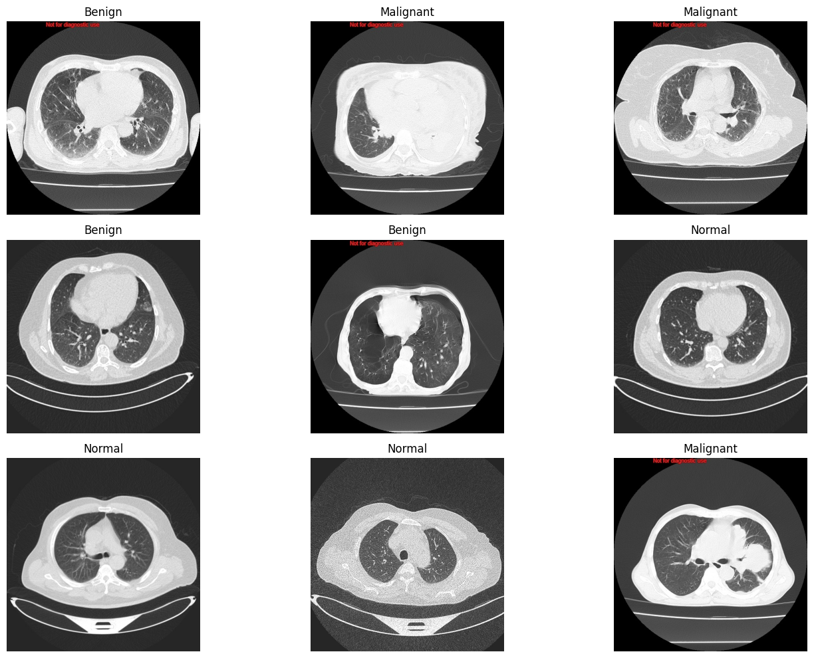
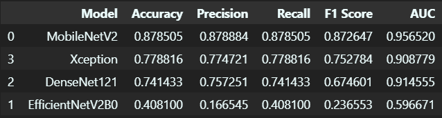
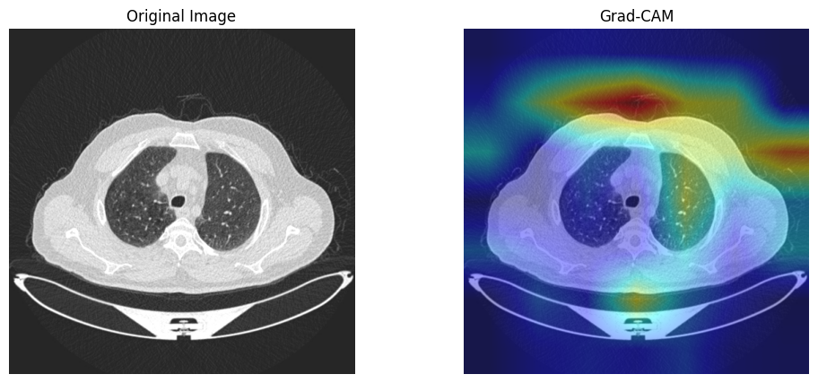
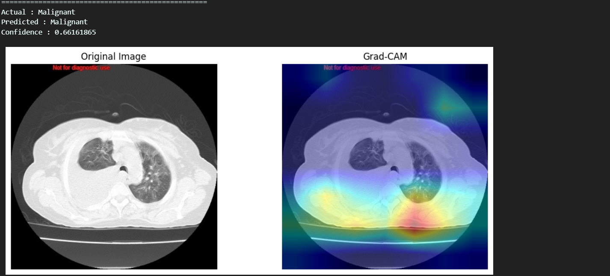
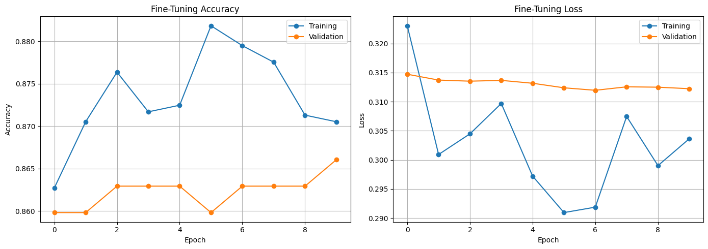

# Lung Cancer Detection using CNN Transfer Learning


## 📋 Project Overview

This project implements a deep learning-based system for detecting lung cancer from CT scan images using state-of-the-art Convolutional Neural Networks (CNNs) with transfer learning. The system classifies CT images into three categories: **Benign**, **Malignant**, and **Normal**. After evaluating multiple pre-trained architectures, **MobileNetV2** emerged as the best-performing model with fine-tuning, achieving high accuracy and robust generalization.

The project includes comprehensive exploratory data analysis, model comparison, performance evaluation, and interpretability using Grad-CAM visualizations to provide explainable AI insights for medical diagnosis.

---

## 📊 Dataset

Dataset Link: https://www.kaggle.com/datasets/rayhankhan831/lung-cancer-ct-scan-image-for-federated-learning

The dataset consists of **3,206** lung CT scan images distributed across three classes:

| Class | Count | Percentage |
|-------|-------|------------|
| Malignant | 1,308 | 40.8% |
| Normal | 986 | 30.8% |
| Benign | 912 | 28.4% |

### Sample Images



*Sample CT scan images from each class (Benign, Malignant, Normal)*

The dataset is sourced from multiple clients (Client1-Client4), simulating a federated learning scenario, though this implementation uses centralized training for model comparison.

### Dataset Characteristics
- **Total Images**: 3,206
- **Image Format**: CT scan images (grayscale converted to RGB)
- **Input Size**: 224x224 pixels (resized for model compatibility)
- **Classes**: 3 (Benign, Malignant, Normal)
- **Split**: Train (80%), Validation (10%), Test (10%)

---

## 🏗️ Methodology

### Data Preprocessing & Augmentation

To enhance model generalization and prevent overfitting, the following augmentation techniques were applied to the training data:

- **Rescaling**: Pixel values normalized to [0,1]
- **Random Horizontal Flip**: 50% probability
- **Random Rotation**: Up to 15 degrees
- **Random Zoom**: Up to 15%
- **Width/Height Shift**: Up to 10%

### Transfer Learning Models

Four pre-trained CNN architectures were evaluated using transfer learning:

1. **MobileNetV2** - Lightweight and efficient architecture
2. **EfficientNetV2B0** - State-of-the-art efficiency
3. **DenseNet121** - Dense connectivity architecture
4. **Xception** - Depthwise separable convolutions

Each model was initialized with ImageNet weights, and the top classification layer was replaced with a custom head:
- Global Average Pooling
- Dense Layer (256 units, ReLU activation)
- Dropout (0.5) for regularization
- Output Layer (3 units, Softmax activation)

### Training Configuration

- **Optimizer**: Adam
- **Loss Function**: Categorical Crossentropy
- **Batch Size**: 32
- **Initial Epochs**: 10
- **Fine-tuning Epochs**: 10
- **Callbacks**: Early Stopping, ReduceLROnPlateau, ModelCheckpoint

### Fine-tuning Strategy

After initial training with frozen base layers, the best model (MobileNetV2) was fine-tuned by:
1. Unfreezing the top 30 layers
2. Using a lower learning rate (1e-5)
3. Training for an additional 10 epochs

---

## 📈 Results

### Model Comparison

| Model | Accuracy | Precision | Recall | F1 Score | AUC |
|-------|----------|-----------|--------|----------|-----|
| **MobileNetV2** | **87.85%** | **87.89%** | **87.85%** | **87.26%** | **95.65%** |
| Xception | 77.88% | 77.47% | 77.88% | 75.28% | 90.88% |
| DenseNet121 | 74.14% | 75.73% | 74.14% | 67.46% | 91.46% |
| EfficientNetV2B0 | 40.81% | 16.65% | 40.81% | 23.66% | 59.67% |

### Performance Visualization



*Comparison of accuracy across different CNN architectures*

MobileNetV2 significantly outperformed other models, demonstrating excellent classification capabilities for lung CT scan analysis. The high AUC score (95.65%) indicates strong discrimination ability between classes.

### Best Model: MobileNetV2 (Fine-tuned)

**Confusion Matrix**:

| | Benign | Malignant | Normal |
|---|--------|-----------|--------|
| **Benign** | 61 | 20 | 11 |
| **Malignant** | 8 | 123 | 0 |
| **Normal** | 0 | 0 | 98 |

**Performance Metrics**:
- **Overall Accuracy**: 87.85%
- **Precision (Weighted)**: 87.89%
- **Recall (Weighted)**: 87.85%
- **F1 Score (Weighted)**: 87.26%
- **AUC (Macro)**: 95.65%

**Class-wise Performance**:
- **Benign**: Precision 88%, Recall 66%, F1 76%
- **Malignant**: Precision 86%, Recall 94%, F1 90%
- **Normal**: Precision 90%, Recall 100%, F1 95%

The model shows exceptional performance in detecting malignant and normal cases, with slightly lower recall for benign cases, which is clinically acceptable as the priority is to identify malignant cases.

---

## 🔍 Grad-CAM Visualizations

Gradient-weighted Class Activation Mapping (Grad-CAM) provides visual explanations of the model's decision-making process by highlighting the regions in CT images that most influenced the prediction.



*Grad-CAM visualization showing the model's focus regions for lung cancer detection*

### Random Predictions with Grad-CAM




*Random test samples with actual labels, predictions, and confidence scores*

The Grad-CAM visualizations show that the model focuses on relevant anatomical regions (lung nodules, tissue abnormalities) when making predictions, providing interpretability crucial for medical applications.

---

## 🚀 Getting Started

### Prerequisites

- Python 3.8+
- TensorFlow 2.19.0
- CUDA-capable GPU (recommended)

### Installation

1. Clone the repository:
```bash
git clone https://github.com/stephinjacob007/Lung-Cancer-Detection-Transfer-Learning.git
cd Lung-Cancer-Detection-Transfer-Learning
```

2. Install dependencies:
```bash
pip install -r requirements.txt
```

3. Download the dataset:
   - Place the dataset in the appropriate directory structure
   - Dataset should have the following structure:
```
LungData/
├── Client1/
│   ├── Benign/
│   ├── Malignant/
│   └── Normal/
├── Client2/
│   ├── Benign/
│   ├── Malignant/
│   └── Normal/
├── Client3/
│   ├── Benign/
│   ├── Malignant/
│   └── Normal/
└── Client4/
    ├── Benign/
    ├── Malignant/
    └── Normal/
```

### Running the Code

1. Open the Jupyter Notebook:
```bash
jupyter notebook Lung_Cancer_Detection_CNNs.ipynb
```

2. Execute cells sequentially to:
   - Load and preprocess data
   - Perform exploratory data analysis
   - Train models
   - Evaluate performance
   - Generate visualizations

---

## 📁 Project Structure

```
Lung-Cancer-Detection-Transfer-Learning/
├── Lung_Cancer_Detection_CNNs.ipynb   # Main Jupyter notebook
├── requirements.txt                    # Python dependencies
├── Results/                            # README images
|   ├── Confusion-Matrices/             # Confusion matrices of all models
│   ├── Models/                         # Accuracy and Loss curves of models
|   ├── Class_Distribution.png
│   ├── Grad-CAM_Example.png
│   ├── Model_Comparison.png
│   ├── Prediction_With_GRAD-CAM.png
│   └── Sample_Images.png
|
└── README.md
```

---

## 🧪 Model Architectures

### MobileNetV2 Architecture (Best Model)

| Layer Type | Output Shape | Parameters |
|------------|--------------|------------|
| MobileNetV2 Base (Frozen) | (7, 7, 1280) | 2.2M |
| Global Average Pooling | (1280) | 0 |
| Dense (ReLU) | (256) | 327,936 |
| Dropout (0.5) | (256) | 0 |
| Dense (Softmax) | (3) | 771 |

**Total Parameters**: ~2.6M (after fine-tuning)

### Why MobileNetV2?

- **Lightweight**: Fewer parameters suitable for deployment
- **Efficiency**: Depthwise separable convolutions reduce computational cost
- **Performance**: Best accuracy among tested models
- **Generalization**: High AUC score indicates robust discrimination

---

## 📊 Evaluation Metrics

- **Accuracy**: Overall correctness of predictions
- **Precision**: Proportion of correct positive predictions
- **Recall**: Proportion of actual positives correctly identified
- **F1 Score**: Harmonic mean of precision and recall
- **AUC-ROC**: Area under the Receiver Operating Characteristic curve

---

## 🩺 Clinical Implications

1. **Early Detection**: The model can assist radiologists in early detection of lung cancer, potentially improving patient outcomes through timely intervention.

2. **Reduced Subjectivity**: AI-based analysis provides consistent and reproducible results, reducing inter-observer variability.

3. **Triage Support**: Can prioritize high-risk cases for immediate review by specialists.

4. **Educational Tool**: Grad-CAM visualizations help in understanding radiological features associated with different classes.

---

## 🔧 Fine-Tuning Results

Fine-tuning the MobileNetV2 model improved performance:

| Metric | Before Fine-tuning | After Fine-tuning |
|--------|-------------------|-------------------|
| Training Accuracy | 87.85% | 88.18% |
| Validation Accuracy | 86.29% | 86.60% |
| Test Accuracy | 87.85% | ~88% |



*Training and validation accuracy/loss curves during fine-tuning*

---

## 🙏 Acknowledgments

- Dataset sourced from Kaggle: [Lung Cancer CT Scan Image for Federated Learning](https://www.kaggle.com/datasets/rayhankhan831/lung-cancer-ct-scan-image-for-federated-learning)
- TensorFlow and Keras teams for providing pre-trained models
- Research community for advancing medical imaging AI

---

## 📧 Contact

Project Link: [https://github.com/stephinjacob007/Lung-Cancer-Detection-Transfer-Learning](https://github.com/stephinjacob007/Lung-Cancer-Detection-Transfer-Learning)

---

## ⚠️ Disclaimer

This project is for research and educational purposes only. The model should not be used as a standalone diagnostic tool. Always consult qualified medical professionals for clinical decisions. The "Not for diagnostic use" label on predictions emphasizes this limitation.

---

## 🔮 Future Work

- [ ] Implement federated learning approach
- [ ] Integrate with a web-based interface for clinical use
- [ ] Expand dataset with more diverse CT scans
- [ ] Implement multi-modal analysis (combine with patient history)
- [ ] Deploy as a mobile application using TensorFlow Lite
- [ ] Ensemble methods for improved accuracy
- [ ] 3D CNN for volumetric analysis of CT scans
